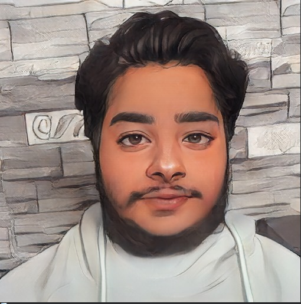

# Computer-Vision_NTI_Digital-Egypt-Youth-Initiative
# AnimeGANv2 - Real Face to Anime Conversion



## Project Overview
The aim of this project is to develop an AI model capable of converting real human face images into anime-style versions. This project leverages **AnimeGANv2**, an improved version of AnimeGAN, delivering faster and higher-quality results on high-resolution images.  

By combining **deep learning**, **image processing**, and **Generative Adversarial Networks (GANs)**, this project transforms real human photos into anime art almost instantly.

---

## Features
- Convert real human face images into anime-style images.
- High-quality results for **256x256 resolution** images.
- Fast inference using optimized AnimeGANv2 architecture.
- Supports multiple anime styles (Hayao, Paprika, Shinkai).

---

## Datasets Used
- **CelebA** – Human face images for generator training.  
- **AnimeFace Dataset** – Anime-style images for generator training.  

### Data Preparation
- Resized all images to `256x256` pixels.  
- Organized images into `trainA` (human faces) and `trainB` (anime faces).  
- Filtered out corrupted files to ensure high-quality training.  
- Converted images to **tensors** or **NumPy arrays**.  
- Normalized pixel values from `[0, 255]` to `[-1, 1]`.  
- Batching & shuffling for stable and efficient training.

---

## Installation

```bash
# Clone the repository
git clone https://github.com/your_username/AnimeGANv2.git
cd AnimeGANv2

# Create a virtual environment (optional)
python -m venv venv
source venv/bin/activate  # On Windows: venv\Scripts\activate

# Install dependencies
pip install -r requirements.txt
